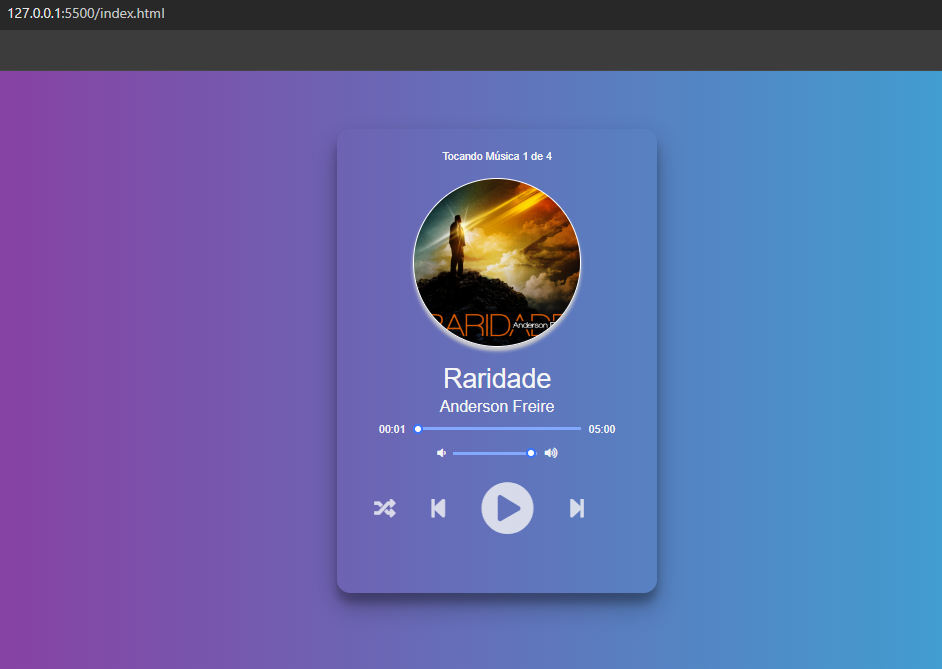

# 🎵 Player de Músicas

Um player de músicas simples, moderno e responsivo, pronto para rodar diretamente no navegador web.

---

## 🚀 Funcionalidades

- ▶️ Play / ⏸️ Pause  
- ⏭️ Avançar faixa  
- ⏮️ Retroceder faixa  
- 🔊 Controle de volume  
- 🎨 Fundo dinâmico que muda de cor a cada música  
- 💿 Animação da capa do álbum  

---

## 🛠️ Tecnologias Utilizadas

- **HTML5** → Estrutura da aplicação  
- **CSS3** → Estilização responsiva e animações  
- **JavaScript (ES6)** → Lógica de reprodução e controles  
- **Font Awesome** → Ícones modernos  

---

## 📂 Estrutura do Projeto

/
├── index.html # Página principal
├── style.css # Estilos do player
├── script.js # Lógica do player em JS
├── imagens/ # Capas das músicas
├── musicas/ # Arquivos de áudio (.mp3)
└── README.md # Documentação

---

## 📖 Como Usar

1. Clone este repositório ou baixe os arquivos ZIP;  
2. Coloque suas músicas na pasta `musicas/`;  
3. Atualize a lista em `script.js` se quiser adicionar novas faixas;  
4. Abra o arquivo **index.html** no navegador;  
5. Aproveite suas músicas! 🎶  

---

## 🔮 Melhorias Futuras

- 📻 Suporte a rádios online;  
- 🎵 Conexão com biblioteca de músicas local;  
- 🎨 Layouts e temas customizáveis;  
- 📂 Criação de playlists favoritas;  
- 🔗 Integração com APIs de música (Spotify, Deezer, etc).  

---

## 📷 Preview

*(adicione aqui um print da interface, ex:)*  

---

## 📜 Licença

Copyright © 2025  
**Music Player - Alex Menezes**  
Este projeto é livre para uso pessoal e educacional.
